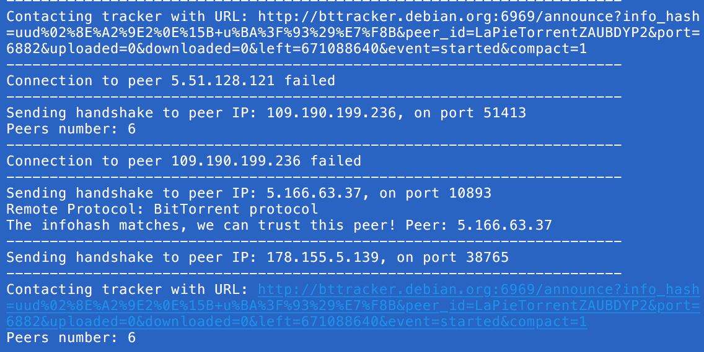

# LaPieTorrent
-
This project is a simplified version of a BitTorrent client. It offers the possibility to download files but not to share them. In order to increase the performance we've used threads.


The version 2.7 of Python has been used for this project.

## How to launch the project ?

1) Clone the repository 

2) If you're using *virtualenv*, install the requirements to get all the packages necessary to run the program.

```
pip install -r path/to/requirements.txt
```

3) Run the program

```
python Main.py
```

## BitTorrent

BitTorrent is a P2P file transfer protocol created in 2001 by Bran Cohen. Its goal is to distribute content without overloading the bandwidth. In order to do so, the original file is chopped in pieces. When a peer wants a file, it will have to get a collection of pieces from different other peers.

BitTorrent uses two protocols : 

- THP (Tracker HTTP/HTTPS Protocol) : used to contact the *Tracker* in order to get a list of peers which have pieces of the file wanted.

- PWP (Peer Wire Protocol) : used to contact peers so we can get pieces from them.


## The project

By default, the file which is downloaded is Debian but this can be changed by modifying the variable *FILE* in *Main.py*.

```
FILE = "Torrent/debian-9.5.0-amd64-xfce-CD-1.iso.torrent"
```

Once you run the program, it will directly contact the *Tracker* in order to get a list of peers. This operation will also be done periodically in order to keep a list of peer that are reachable.

The second step is to contact the peers in order to get piece from them.



Every time a piece is downloaded from a peer, an entry in a CSV file is done. It records the date, ip of the peer, port, the peer version, the download speed and the pieces it has.


